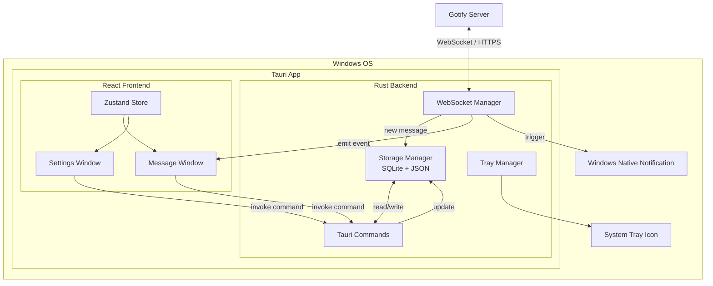

# Nexthrum - 架构设计

## 系统架构图



## 模块职责

### Rust Backend

#### `main.rs`
- 入口点，调用 `lib::run()`
- Release 模式隐藏控制台窗口

#### `lib.rs`
- 定义核心数据结构：`AppSettings`, `GotifyMessage`, `MessageListItem`, `AppState`
- 注册所有 Tauri commands
- 在 `setup` 中初始化窗口、托盘、WebSocket 连接、定时清理任务
- 管理全局 `AppState`（设置 + WebSocket 句柄）

#### `websocket.rs`
- `WsHandle` 结构体：持有 `tokio::task::AbortHandle` 用于取消连接
- `connect()`: 建立 WebSocket 连接，spawn 读取 task
- `reconnect()`: 断开旧连接 + 建立新连接
- `disconnect()`: 取消读取 task
- `handle_incoming_message()`: 处理消息 → 存储 → 通知 → 发射事件
- `is_in_dnd_period()`: 判断当前是否在免打扰时段

#### `storage.rs`
- SQLite 数据库路径：`%APPDATA%/Nexthrum/nexthrum_messages.db`
- 表结构 `messages`：id, appid, message, title, priority, date, extras, read, received_at
- 设置文件路径：`%APPDATA%/Nexthrum/nexthrum_data/settings.json`
- 提供 CRUD 操作：save, get, mark_read, delete, clear, get_unread_count, cleanup_old

#### `tray.rs`
- 创建系统托盘图标和右键菜单
- 处理菜单事件（显示消息/设置/退出）
- 处理左键单击事件（显示消息窗口）
- 程序化生成 32×32 蓝色铃铛托盘图标

### React Frontend

#### `App.tsx`
- 根组件，根据 `currentView` 切换消息窗口/设置窗口
- 挂载时从后端加载初始数据（设置、消息、未读数）
- 注册 `useTauriEvents` 监听后端事件

#### `store/useAppStore.ts`
- Zustand 全局状态，管理：settings、messages、UI 状态、App 列表、WebSocket 状态
- 提供 actions：set/add/remove/clear 消息，set 设置，切换视图等

#### `hooks/useTauriEvents.ts`
- 监听 Tauri 后端事件：
  - `new-message` → 添加到消息列表
  - `unread-count-changed` → 更新未读数
  - `show-settings` → 切换到设置视图
  - `notification-clicked` → 聚焦窗口

#### `components/MessageWindow/`
- `MessageWindow.tsx`: 消息窗口容器，组合 Toolbar + AppFilter + MessageList
- `Toolbar.tsx`: 标题、连接状态灯、未读计数、Clear All 按钮（含确认弹窗）、Settings 按钮
- `AppFilter.tsx`: App 来源筛选标签栏，"All Apps" + 各 App 标签
- `MessageList.tsx`: 消息列表，支持按 App 筛选，空状态提示
- `MessageItem.tsx`: 单条消息卡片，点击复制 + 已读标记，右键删除菜单

#### `components/SettingsWindow/`
- `SettingsWindow.tsx`: 设置表单，含服务器连接测试、开关、数字输入、时间选择器

## 数据持久化

### 消息存储（SQLite）

```sql
CREATE TABLE messages (
    id          INTEGER PRIMARY KEY,
    appid       INTEGER NOT NULL,
    message     TEXT NOT NULL,
    title       TEXT NOT NULL,
    priority    INTEGER NOT NULL DEFAULT 0,
    date        TEXT NOT NULL,
    extras      TEXT,
    read        INTEGER NOT NULL DEFAULT 0,
    received_at TEXT NOT NULL DEFAULT (datetime('now'))
);
```

### 设置存储（JSON）

```json
{
  "server_url": "https://gotify.example.com",
  "client_token": "abc123...",
  "auto_start": false,
  "minimize_to_tray": true,
  "history_retention_days": 7,
  "do_not_disturb_start": "22:00",
  "do_not_disturb_end": "08:00"
}
```

## 通信协议

### 前端 → 后端 (Tauri Commands)

| Command | 参数 | 返回 | 说明 |
|---------|------|------|------|
| `get_settings` | - | `AppSettings` | 获取设置 |
| `save_settings` | `settings: AppSettings` | `()` | 保存设置 |
| `get_messages` | - | `Vec<MessageListItem>` | 获取消息列表 |
| `mark_message_read` | `message_id: i64` | `()` | 标记已读 |
| `delete_message` | `message_id: i64` | `()` | 删除单条消息 |
| `clear_messages` | `sync_server: bool` | `()` | 清空全部消息 |
| `get_unread_count` | - | `i64` | 获取未读数 |
| `connect_websocket` | - | `()` | 手动连接 WebSocket |
| `disconnect_websocket` | - | `()` | 断开 WebSocket |

### 后端 → 前端 (Tauri Events)

| Event | Payload | 说明 |
|-------|---------|------|
| `new-message` | `GotifyMessage` | 新消息到达 |
| `unread-count-changed` | `number` | 未读数变化 |
| `show-settings` | `()` | 用户从托盘菜单点击设置 |
| `notification-clicked` | `number` (message id) | 用户点击了通知 |
